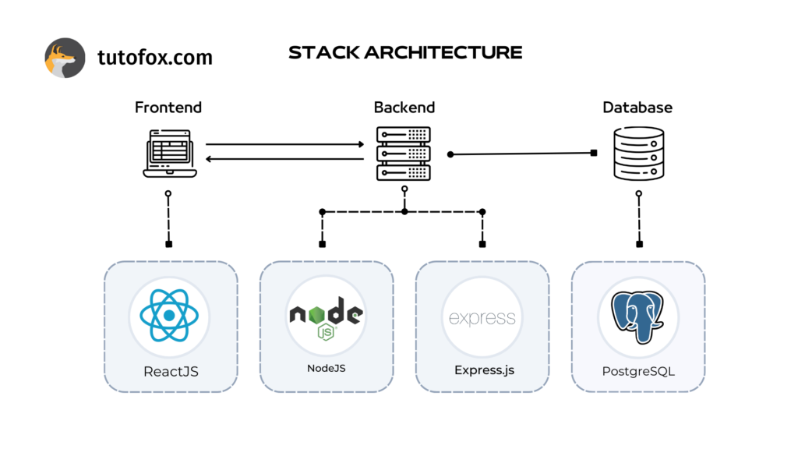

# **ReMan-Backend**
# **Project Overview**

Here in `ReMan`, we Connect The `Retailers` and `Manufacturers` through a completely digital platform.


The backend of the project is deployed on AWS EC2 and can be accessed here : [http://3.111.213.171:3000/](http://3.111.213.171:3000/)

The frontend of the project can be found in the following repository : [ReMan-Frontend](https://github.com/Frost101/ReMan-Frontend)


# **Project Architecture**

We followed the MVC Architecture for this project



# **Tech Stack & Tools**

- Frontend : `React`, `HTML`, `CSS`, `JS`
- Backend : `Node JS`, `Express JS`
- Database : `PostgreSQL`
- Miscellaneous : `Swagger`, `Postman`

### Clear the ports
```
sudo killall -9 node
```

