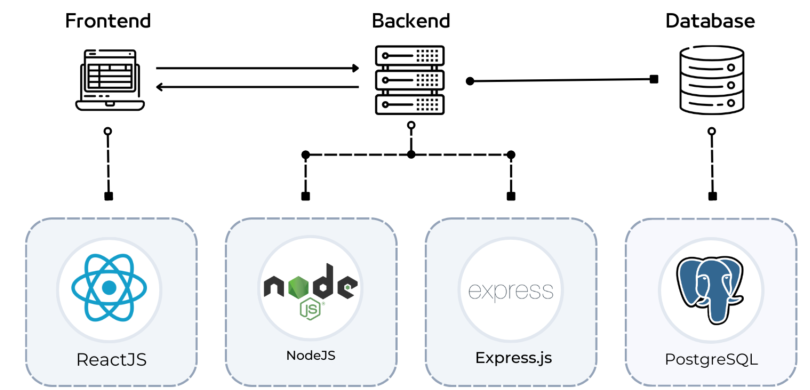

# **ReMan-Backend**
# **Project Overview**

Here in <b>ReMan</b>, we connect the <b>Retailers</b> and <b>Manufacturers</b> through a completely digital platform, without any interference from any third party.

The frontend of the project can be found in the following repositories : [ReMan-Frontend-Manufacturer](https://github.com/Frost101/ReMan-Frontend)     [ReMan-Frontend-Retailer](https://github.com/sabahcsxgawd/ReMan-Frontend-Retailer)

# **Project Architecture**

We followed the MVC Architecture for this project

# **Tech Stack & Tools**

- Frontend : `React`, `HTML`, `CSS`, `JS`
- Backend : `Node JS`, `Express JS`
- Database : `PostgreSQL`
- ORM: `Prisma`
- Payment Gateway: `sslcommerz`
- Miscellaneous : `Swagger`, `Postman`

# **API Documentation**

Swagger was used to document the API endpoints. [Swagger Link](https://reman-backend-v9rf.onrender.com/api-docs/)

# Features for Retailers

- **Marketplace Browsing**: Retailers can explore a categorized marketplace and view products from various manufacturers.
- **Bulk Ordering Discounts**: Discounts increase with higher order amounts, making bulk purchases more economical.
- **Order Management**: 
  - Place orders with a minimum quantity.
  - Modify quantities or add more products after adding to cart.
  - Apply vouchers for additional discounts.
- **Payment Options**: Support for cash-on-delivery and online payments via **SSLCommerz**.
- **Order History and Tracking**: View previous orders and track the shipment status (shipped/delivered).
- **Product Reviews and Ratings**: Provide feedback and ratings for purchased products.
- **Get Notifications**: Get notifications for order delivery and shipment of particular products. 

